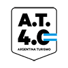
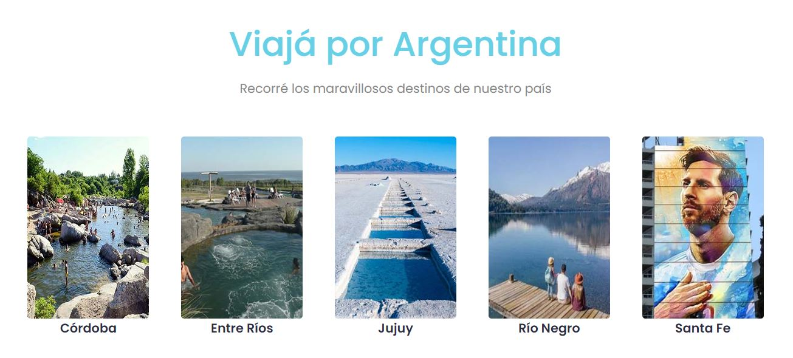

   

**Argentina Turismo 4.0** es el resultado del **Trabajo Práctico Integrador** presentado por el "Equipo 4", en el nivel inicial de **Argentina Programa 4.0.**

La idea de desarrollar una página de turismo que proponga recorrer Argentina, refleja nuestro placer en común, además de ofrecer la posibilidad de que todos pudieran crear **su** página dentro de una web en lugar de sólo una sección. Manteniendo su identidad única en el manejo de espacios como navbar y footer; la paleta de colores, fuentes, etc.

Para el desarrollo de está página utilizamos: **HTML,CSS y JavaScript** incorporando también herramientas del framework **Bootstrap**, **Leaflet**, **jsPdf** y un .json local.

Link a la página: https://lorena-distefano.github.io/Argentina-Turismo-4.0/    🚀 

Agradecemos a **Argentina Programa 4.0** la oportunidad de sumar herramientas y conocimientos que nos abrirán puertas en el mundo IT.

✒️ El equipo: **Cristina Alegre, Lorena Di Stefano, Silvina Gaitan, Marcos Gaso, Sebastián Pittaluga**

Abril 2023
